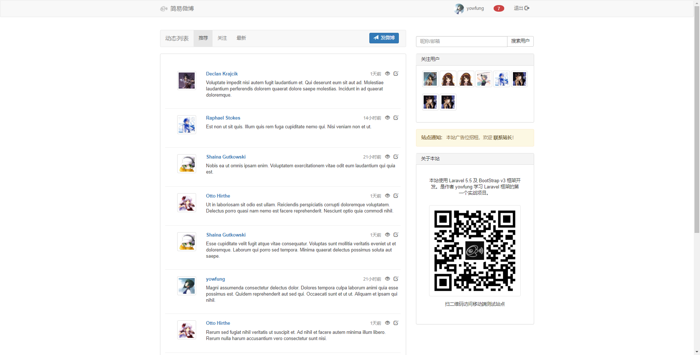
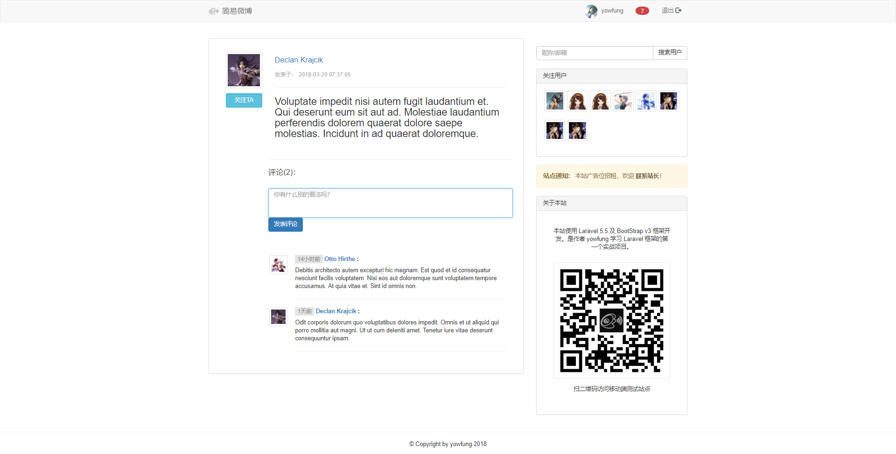
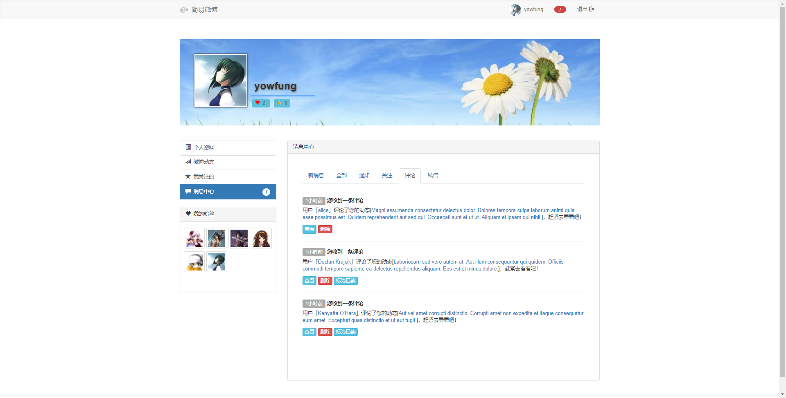

## 项目概述

- 项目名称： 简易微博

- 项目代号： yowfung/microBlog

- 开发人员： [yowfung](https://github.com/YowFung/)

- 开发框架： Laravel 5.5/BootStrap v3

- 当前版本： 1.1.0


&nbsp;&nbsp;&nbsp;&nbsp;&nbsp;&nbsp;&nbsp;&nbsp;

&nbsp;&nbsp;&nbsp;&nbsp;&nbsp;&nbsp;&nbsp;&nbsp;**yowfung/microBlog** 是一个简洁的微博应用网站，使用 Laravel 5.5 后端框架及 BootStrap v3 前端框架编写而成。该项目为本人(yowfung)学习 Laravel 开发框架的第一个实战项目。

&nbsp;&nbsp;&nbsp;&nbsp;

## 网站实际效果










## 项目结构

#### 角色

&nbsp;&nbsp;&nbsp;&nbsp;&nbsp;&nbsp;&nbsp;&nbsp;在本微博应用中，将会出现以下角色：

- 游客——没有登录的用户；
- 用户——注册的用户。

#### 信息

&nbsp;&nbsp;&nbsp;&nbsp;&nbsp;&nbsp;&nbsp;&nbsp;主要信息有：

- 用户——模型名称 User，微博为UGC产品，所有内容都围绕用户来进行；
- 动态——模型名称 Note，该微博应用的最核心数据；
- 消息——模型名称 Message，包含系统通知、关注提醒、动态评论提醒及私信；
- 评论——模型名称 Comment，针对某个用户下某条动态的讨论，一条动态可有多条评论。

#### 动作

&nbsp;&nbsp;&nbsp;&nbsp;&nbsp;&nbsp;&nbsp;&nbsp;即角色和信息之间的互动，主要有：

- 创建 create
- 查看 index/show
- 编辑 edit/update
- 删除 destroy


&nbsp;&nbsp;&nbsp;&nbsp;


## 角色用例

1. 游客：
   - 游客可以查看所有推荐的和最新的动态列表；
   - 游客可以查看单条动态的详细内容及其所有评论；
   - 游客可以访问用户主页并查看用户基本资料及其发表的动态；
   - 游客可以搜索用户；
   - 游客可以通过注册按钮创建用户。
2. 用户：
   - 用户可以使用游客除创建用户外的所有权限；
   - 用户可以发表和管理微博动态；
   - 用户可以接收、查看和管理消息；
   - 用户可以给其他用户发送私信；
   - 用户可以关注/取消关注其他用户；
   - 用户可以拥有粉丝；
   - 用户可以查看所有关注人的动态列表；
   - 用户可以修改头像、基本资料和登录密码；
   - 用户可以评论其他用户发表的动态。


&nbsp;&nbsp;&nbsp;&nbsp;


## 项目架构

#### 架构模式

&nbsp;&nbsp;&nbsp;&nbsp;&nbsp;&nbsp;&nbsp;&nbsp;本项目采用 PHP Laravel 框架开发，Laravel 是 Taylor Otwell 开发的一款基于 PHP 语言的 Web 开源框架，采用了 MVC 的架构模式。该框架有以下原则：

- 强调与注重敏捷开发；
- 约定高于配置；
- DRY，提倡代码复用；
- 重视「编程愉悦性」。

#### 代码规范

&nbsp;&nbsp;&nbsp;&nbsp;&nbsp;&nbsp;&nbsp;&nbsp;本项目代码严格遵循PSR规范。

#### 路由规范

&nbsp;&nbsp;&nbsp;&nbsp;&nbsp;&nbsp;&nbsp;&nbsp;本项目路由遵循RESTFul设计规范。

&nbsp;&nbsp;&nbsp;&nbsp;

## 表单验证

&nbsp;&nbsp;&nbsp;&nbsp;&nbsp;&nbsp;&nbsp;&nbsp;所有表单验证均通过 Laravel Request 类及自定义的 FormRequest 类实现。包括用户注册时的表单验证、用户登录时的表单验证、修改资料及密码时的表单验证、上传头像时的表单验证、发表动态及评论时的表单验证、发送私信时的表单验证等。

&nbsp;&nbsp;&nbsp;&nbsp;&nbsp;&nbsp;&nbsp;

## 权限与安全

&nbsp;&nbsp;&nbsp;&nbsp;&nbsp;&nbsp;&nbsp;&nbsp;为保证网站系统及用户数据安全，应对用户访问权限进行限制，即：

- 未登录用户不能访问修改资料和修改密码界面；
- 未登录用户不能提交头像修改请求；
- 未登录用户不能提交关注/取消关注请求；
- 未登录用户不能提交发送私信、发表评论的请求；
- 未登录用户不能访问关注人动态列表；
- 未登录用户不能访问消息中心界面；
- 已登录用户不能访问其他用户的修改资料和修改密码界面；
- 已登录用户不能访问其他用户的关注人列表界面；
- 已登录用户不能访问其他用户的消息；
- 已登录用户不能提交更新其他用户数据的请求；
- 已登录用户不能删除其他用户的动态、评论和消息；


&nbsp;&nbsp;&nbsp;&nbsp;


&nbsp;&nbsp;&nbsp;&nbsp;&nbsp;&nbsp;&nbsp;&nbsp;本项目通过三层手段来保证权限和安全：

1. 不渲染无权访问的视图；
2. 通过 Laravel 的中间件（Middleware）来阻止路由请求；
3. 通过Laravel 的授权策略（Policy）来验证权限；


&nbsp;

## 项目测试

#### 测试环境要求  

> Ubuntu 16.04 LTS +
>
> Nginx 1.10 +
>
> MySQL 5.7 +
>
> PHP 7.1 +


#### 克隆源代码

```shell
    git clone git@github.com:YowFung/microBlog.git
```

#### 安装及配置

1. Composer 安装：

```shell
    composer install
```

2. 修改配置：

&nbsp;&nbsp;&nbsp;&nbsp;&nbsp;&nbsp;&nbsp;&nbsp;将 `.env.example` 修改成 `.env` ：

```shell
    sudo cp .env.example .env
```

&nbsp;&nbsp;&nbsp;&nbsp;&nbsp;&nbsp;&nbsp;&nbsp;根据实际情况配置 `.env` 文件，例如：

```php
    APP_URL=http://microBlog.yowfung.cn
    APP_NAME=microBlog
    APP_KEY=xxxxxxxx...
    APP_DEBUG=true
    ...
    DEFAULT_AVATAR=/img/photos/default.jpg
      
    DB_HOST=localhost
    DB_DATABASE=microBlog
    DB_USERNAME=test
    DB_PASSWORD=test
    ...
```

3. 设置文件访问权限：

```shell
    sudo chmod -R 777 ./storage/
```

4. 设置 APP key：

```shell
    php artisan key:generate
```

5. 生成数据表，并填充测试数据：

```shell
    php artisan migrate --seed
```

#### 测试运行

1. 运行服务：

```shell
php artisan serve
```

2. 访问测试网站：

   http://localhost:8000/


&nbsp;&nbsp;&nbsp;&nbsp;

## 项目上线

- 基本环境部署步骤与测试环境部署一致，但需要将 `.env` 的 `APP_URL` 及`DB_*` 设置成实际上线的域名和数据库配置，并一定要将 `APP_DEBUG` 设置成 `false` 。
- 需要自己配置Nginx域名绑定。
- 正式运营网站前请执行 `php artisan migrate:refresh` 。


&nbsp;&nbsp;&nbsp;&nbsp;

## 版权声明

- 本项目由 yowfung 开发，项目开源，欢迎共同讨论。
- 联系邮箱：[yowfung@outlook.com](mailto:yowfung@outlook.com)
- 个人博客：[www.yowfung.cn](http://www.yowfung.cn/)

​   